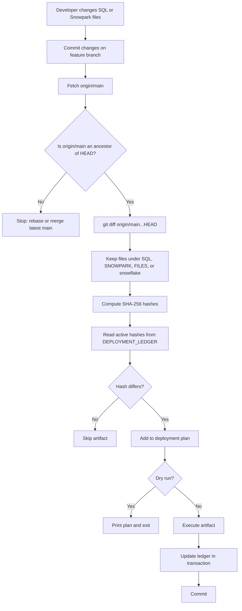
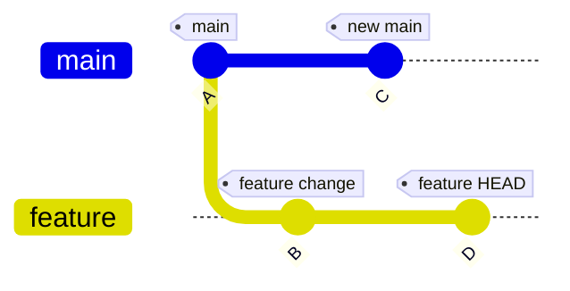
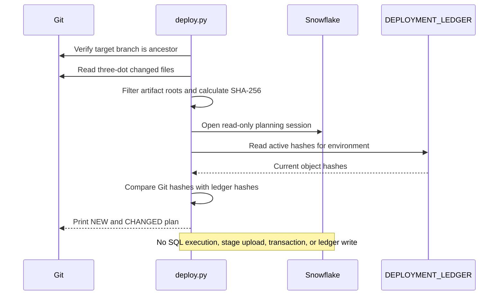
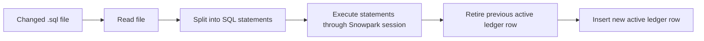
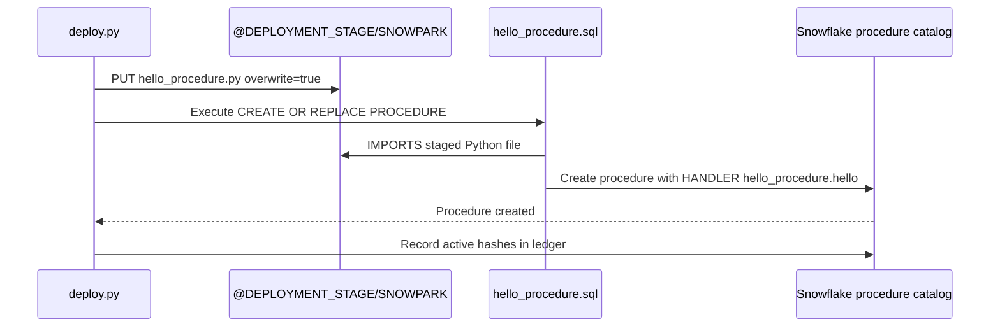
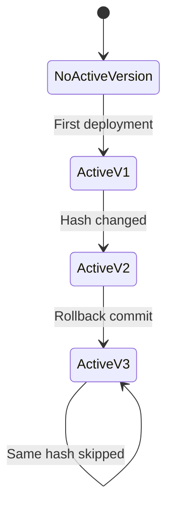
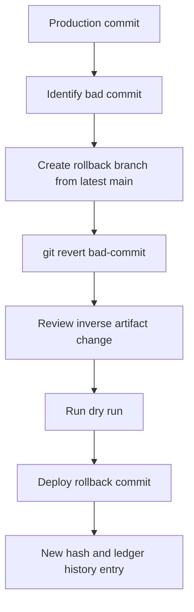

# Deployment Flow Visual Guide

This framework uses Git to define the requested change set and the Snowflake ledger to define what is already applied in each environment.

## 1. Overall deployment flow



## 2. Feature branch guardrail



The feature branch must first contain commit `C`:

```powershell
git fetch origin
git rebase origin/main
```

The deployment engine then compares the feature branch to the target branch:

```text
git diff origin/main...HEAD --name-only
```

This means: deploy changes introduced by the feature branch, not every file changed anywhere in repository history.

## 3. Dry-run flow



Run it with:

```powershell
python deployment/deploy.py `
  --environment DEV `
  --target-ref origin/main `
  --connection-name dev `
  --warehouse DEV_WH `
  --password-auth `
  --dry-run
```

Example output:

```text
Branch artifacts: 2; pending deployments: 2
Deployment plan:
  CHANGED .py  SNOWPARK/hello_procedure.py old-hash -> new-hash
  CHANGED .sql SNOWPARK/hello_procedure.sql old-hash -> new-hash
Dry run complete. No Snowflake artifacts or ledger rows were changed.
```

## 4. SQL deployment flow



SQL files are executed in sorted path order. This allows files such as `SNOWPARK/00_create_stage.sql` to run before the Python upload and procedure definition.

## 5. Snowpark deployment flow

The Python file is a standalone handler. It does not call `sproc.register`.



Repository files:

```text
SNOWPARK/
  00_create_stage.sql
  hello_procedure.py
  hello_procedure.sql
```

Procedure definition:

```sql
create or replace procedure HELLO_FROM_SNOWPARK(name string)
returns string
language python
runtime_version = '3.11'
packages = ('snowflake-snowpark-python')
imports = ('@DEPLOYMENT_STAGE/SNOWPARK/hello_procedure.py')
handler = 'hello_procedure.hello';
```

Call it with:

```sql
call HELLO_FROM_SNOWPARK('Snowflake');
```

If the Python hash changes, the engine automatically includes the companion `.sql` file in the plan so the procedure is recreated against the new staged source.

## 6. Ledger state transition



The ledger is append-only. A new deployment:

1. Marks the previous `(environment, object_name)` row inactive.
2. Inserts a new active row with the new hash and Git commit.
3. Records the deployment ID and timestamp.

## 7. Rollback flow



Example:

```powershell
git switch main
git pull origin main
git switch -c rollback/undo-bad-deployment
git revert <bad-commit-sha>
git push -u origin rollback/undo-bad-deployment
```

A rollback is a new desired state. Do not check out an old commit and deploy it directly because it may not contain the latest target branch and may produce an incomplete diff.

For tables, use explicit forward or reverse migrations. Deletions are not inferred from Git deletes by this engine.

## 8. Current capabilities

| Capability | Supported behavior |
|---|---|
| Git scope detection | Three-dot diff between target ref and `HEAD` |
| Branch safety | Stops when target ref is not an ancestor of `HEAD` |
| Hash detection | SHA-256 of changed artifact bytes |
| Environment state | Active hash tracked independently per environment |
| Dry run | Reads ledger and prints the exact pending plan without mutation |
| SQL artifacts | Executes `.sql` files in sorted path order |
| Snowpark source | Uploads standalone `.py` files to an internal stage |
| Procedure creation | Executes companion `CREATE OR REPLACE PROCEDURE` SQL |
| Idempotency | Matching active hashes are skipped |
| Rollback | Supported through a new `git revert` commit |
| Audit history | Git commit, hash, environment, timestamp, and deployment ID |
| Local authentication | Named `connections.toml` profile, password or OAuth mode |
| CI authentication | GitHub environment secrets |

## 9. Current boundaries

- The engine executes `.sql` and `.py`; `FILES/*.csv` is not automatically loaded.
- Deleted files are ignored; destructive changes require explicit SQL.
- Snowflake DDL may implicitly commit, so a failed DDL operation may require reconciliation.
- A `connections.toml` profile must provide a real warehouse, or use `--warehouse`.
- The ledger table must be created before dry runs or deployments.
