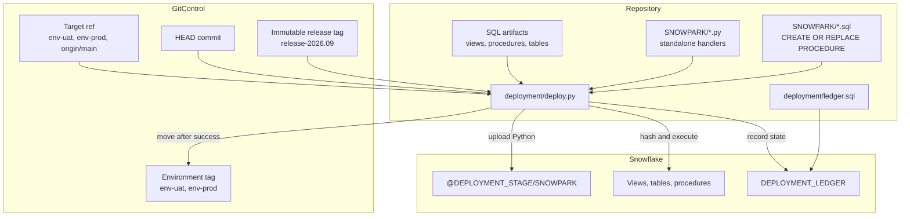
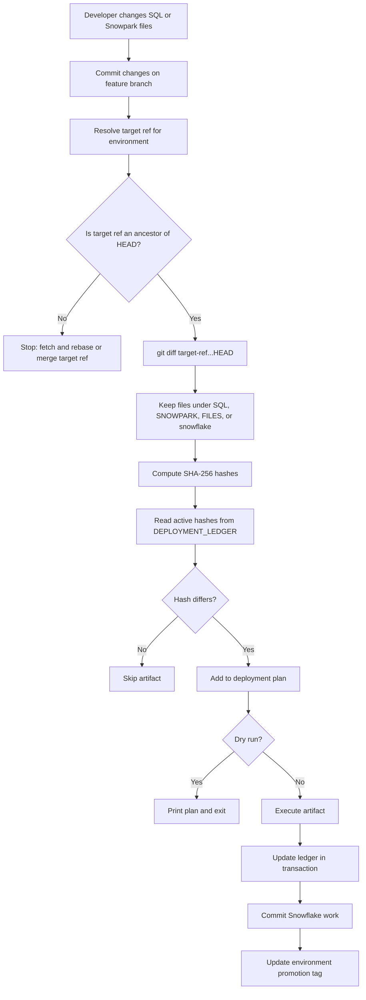
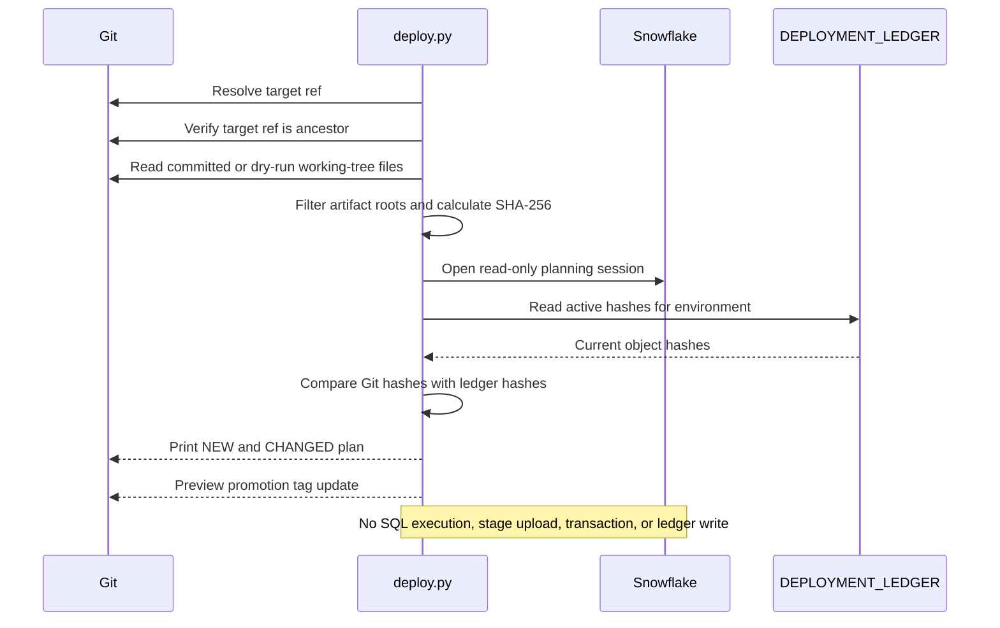
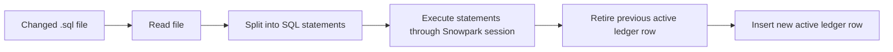
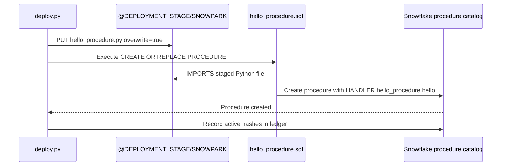
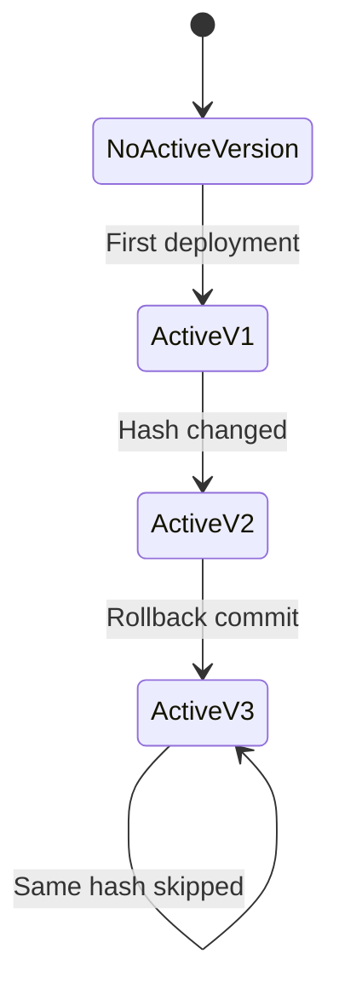
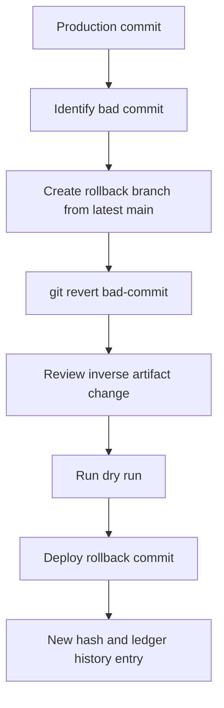
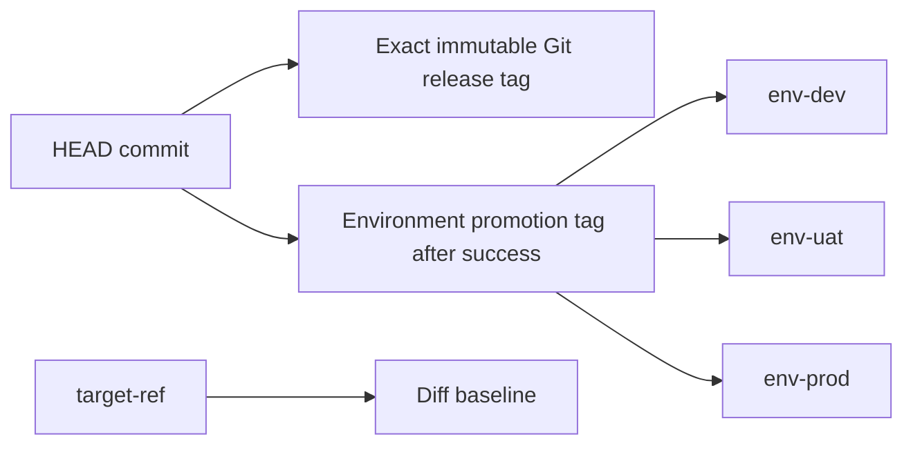

# Deployment Flow Visual Guide

This framework uses Git to define the requested change set and the Snowflake ledger to define what is already applied in each environment.

## 1. Implementation flow



Responsibilities:

| Component | Responsibility |
|---|---|
| `deployment/deploy.py` | Orchestrates Git scope, hashing, Snowflake execution, ledger writes, and promotion tags |
| `deployment/ledger.sql` | Creates and upgrades the Snowflake state ledger |
| `SQL/` and `snowflake/` | Stores executable SQL artifacts |
| `SNOWPARK/*.py` | Stores standalone Python handlers uploaded to the internal stage |
| `SNOWPARK/*.sql` | Creates procedures that import staged Python files |
| `target_ref` | Defines the Git baseline for the promotion diff |
| `promotion_tag` | Points to the last successful environment deployment |

## 2. Execution flow



Runtime sequence:

```mermaid
sequenceDiagram
    participant CLI as CLI
    participant Engine as deploy()
    participant Git as Git
    participant SF as Snowflake session
    participant Ledger as DEPLOYMENT_LEDGER
    participant Stage as Internal stage

    CLI->>Engine: parse_args()
    Engine->>Git: resolve_target_ref(environment, target_ref)
    Engine->>Git: assert_clean_worktree() for live mode
    Engine->>Git: assert_branch_is_current(target_ref)
    Engine->>Git: branch_files(target_ref, dry_run)
    Engine->>Engine: collect_artifacts() and sha256_file()
    Engine->>SF: create_session()
    Engine->>Ledger: load_active_hashes(environment)
    Ledger-->>Engine: active object hashes
    Engine->>Engine: pending_artifacts() and print_plan()
    alt dry run
      Engine-->>CLI: print plan and tag preview
    else live deployment
      Engine->>SF: BEGIN
      loop each pending artifact
        alt SQL artifact
          Engine->>SF: execute_sql_file()
        else Snowpark Python artifact
          Engine->>Stage: upload_python_file()
          Engine->>SF: execute companion procedure SQL
        end
        Engine->>Ledger: retire old row and insert SUCCESS row
      end
      Engine->>SF: COMMIT
      Engine->>Git: update_environment_tag()
      Engine-->>CLI: deployment complete
    end
  ```

## 3. Feature branch guardrail

```mermaid
gitGraph
   commit id: "A" tag: "main"
   branch feature
   checkout feature
   commit id: "B" tag: "feature change"
   checkout main
   commit id: "C" tag: "new main"
   checkout feature
   commit id: "D" tag: "feature HEAD"
```

The feature branch must first contain the selected target ref:

```powershell
git fetch origin
git rebase <target-ref>
```

The deployment engine then compares the feature branch to the target branch:

```text
git diff <target-ref>...HEAD --name-only
```

This means: deploy changes introduced after the target baseline, not every file changed anywhere in repository history. For a first promotion, the target can be the repository root commit. For later environment promotions, it is normally that environment's mutable tag, such as `env-uat` or `env-prod`.

## 4. Dry-run flow



Run it with:

```powershell
python deployment/deploy.py `
  --environment DEV `
  --target-ref origin/main `
  --connection-name dev `
  --warehouse DEV_WH `
  --password-auth `
  --dry-run
```

Example output:

```text
Branch artifacts: 2; pending deployments: 2
Deployment plan:
  CHANGED .py  SNOWPARK/hello_procedure.py old-hash -> new-hash
  CHANGED .sql SNOWPARK/hello_procedure.sql old-hash -> new-hash
Dry run complete. No Snowflake artifacts or ledger rows were changed.
```

## 5. SQL deployment flow



SQL files are executed in sorted path order. This allows files such as `SNOWPARK/00_create_stage.sql` to run before the Python upload and procedure definition.

## 6. Snowpark deployment flow

The Python file is a standalone handler. It does not call `sproc.register`.



Repository files:

```text
SNOWPARK/
  00_create_stage.sql
  hello_procedure.py
  hello_procedure.sql
```

Procedure definition:

```sql
create or replace procedure HELLO_FROM_SNOWPARK(name string)
returns string
language python
runtime_version = '3.11'
packages = ('snowflake-snowpark-python')
imports = ('@DEPLOYMENT_STAGE/SNOWPARK/hello_procedure.py')
handler = 'hello_procedure.hello';
```

Call it with:

```sql
call HELLO_FROM_SNOWPARK('Snowflake');
```

If the Python hash changes, the engine automatically includes the companion `.sql` file in the plan so the procedure is recreated against the new staged source.

## 7. Ledger state transition



The ledger is append-only. A new deployment:

1. Marks the previous `(environment, object_name)` row inactive.
2. Inserts a new active row with the new hash and Git commit.
3. Records the deployment ID and timestamp.
4. Records source path, artifact type, target ref, release tag, promotion tag, previous hash, timing, runner, and request metadata.

## 8. Rollback flow



Example:

```powershell
git switch main
git pull origin main
git switch -c rollback/undo-bad-deployment
git revert <bad-commit-sha>
git push -u origin rollback/undo-bad-deployment
```

A rollback is a new desired state. Do not check out an old commit and deploy it directly because it may not contain the latest target branch and may produce an incomplete diff.

For tables, use explicit forward or reverse migrations. Deletions are not inferred from Git deletes by this engine.

## 9. Environment tags and release tags



`target_ref` is the baseline used to calculate the diff. `release_tag` is an exact release tag on `HEAD`, such as `release-2026.09`, and may be null. `promotion_tag` is the environment pointer moved after successful deployment, such as `env-prod`. They are intentionally different fields.

## 10. Current capabilities

| Capability | Supported behavior |
|---|---|
| Git scope detection | Three-dot diff between resolved target ref and `HEAD` |
| Branch safety | Stops when target ref is not an ancestor of `HEAD` |
| Hash detection | SHA-256 of changed artifact bytes |
| Environment state | Active hash tracked independently per environment |
| Dry run | Reads ledger and prints the exact pending plan without mutation |
| SQL artifacts | Executes `.sql` files in sorted path order |
| Snowpark source | Uploads standalone `.py` files to an internal stage |
| Procedure creation | Executes companion `CREATE OR REPLACE PROCEDURE` SQL |
| Idempotency | Matching active hashes are skipped |
| Rollback | Supported through a new `git revert` commit |
| Audit history | Git commit, hash, environment, timestamp, and deployment ID |
| Local authentication | Named `connections.toml` profile, password or OAuth mode |
| CI authentication | GitHub environment secrets |
| Environment promotion tags | Creates or updates `env-<environment>` after success |
| Release metadata | Records exact Git release tag separately from promotion tag |

## 11. Current boundaries

- The engine executes `.sql` and `.py`; `FILES/*.csv` is not automatically loaded.
- Deleted files are ignored; destructive changes require explicit SQL.
- Snowflake DDL may implicitly commit, so a failed DDL operation may require reconciliation.
- A `connections.toml` profile must provide a real warehouse, or use `--warehouse`.
- The ledger table must be created before dry runs or deployments.

## 12. FAQ

### Why did the script deploy nothing on `main`?

If `HEAD` equals `origin/main`, the scope `origin/main...HEAD` is empty. For a first environment promotion, use the repository root commit or create an environment baseline tag.

### Does a dry run require Snowflake?

Yes for a ledger-aware dry run. It reads active hashes from the target environment but does not execute SQL, upload Python, update the ledger, or move tags.

### What happens if the working tree has uncommitted files?

Dry runs include staged, unstaged, and untracked artifact files. Live deployments reject a dirty working tree because the ledger records the committed `HEAD` hash.

### What is the difference between `target_ref`, `release_tag`, and `promotion_tag`?

`target_ref` is the comparison baseline, `release_tag` identifies an exact immutable release tag on `HEAD`, and `promotion_tag` identifies the environment pointer updated after success.

### When does the environment tag move?

Only after Snowflake execution and ledger commit succeed. A failed deployment leaves the previous environment tag unchanged.

### Does the engine call `sproc.register`?

No. It uploads standalone Snowpark Python files with `session.file.put`, then executes companion SQL containing `CREATE OR REPLACE PROCEDURE ... IMPORTS`.

### How is rollback performed?

Create a new branch from the latest target branch, run `git revert <bad-commit>`, preview it, and deploy the resulting rollback commit. Do not deploy an old commit directly.

### What does `--skip-ancestor-check` do?

It bypasses the branch freshness guardrail with a warning. Use it only for deliberate local testing or an emergency procedure with explicit review.
